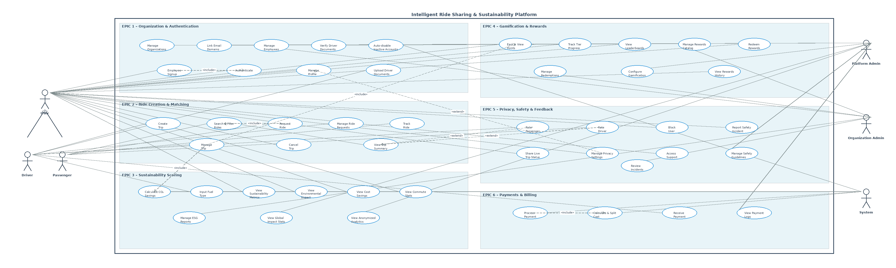
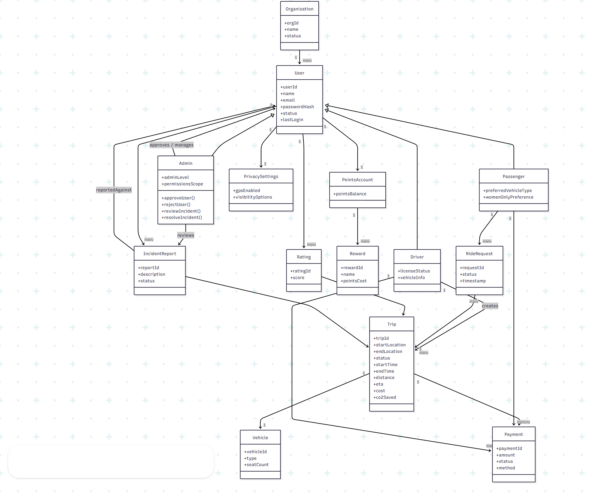

# 🌱 GreenCommute

## Intelligent Ride Sharing & Sustainable Mobility Platform

> A secure, organization-based carpooling platform enabling employees to share rides efficiently with geospatial trip matching, real-time tracking, and multi-level administrative control.

---

## 🚀 Overview

GreenCommute is a full-stack ride-sharing platform designed for **corporate and institutional environments**.

It enables:

* 🏢 Organization-scoped access
* 👨‍💼 Role-based workflows (Platform Admin → Org Admin → Employee → Driver)
* 📍 Intelligent geolocation-based trip matching
* 🚗 Driver verification with document approval
* 🔄 Real-time ride lifecycle tracking
* 🌍 Fully open-source maps stack (no paid APIs)

---

## 🧠 System Architecture

### 🏗 High-Level Modules

```
┌────────────────────────────────────────────┐
│                FRONTEND (React)            │
│  - Authentication UI                       │
│  - Role-Based Dashboards                   │
│  - Trip Creation & Search                  │
│  - Maps & Autocomplete                     │
│  - Real-time Updates (Socket.io)           │
└────────────────────────────────────────────┘
                    │
                    ▼
┌────────────────────────────────────────────┐
│              BACKEND (Node + Express)      │
│  - Auth & JWT Middleware                   │
│  - Organization Isolation                  │
│  - Driver Verification Workflow            │
│  - Trip Matching Engine                    │
│  - Ride Management                         │
│  - Real-time Location Updates              │
└────────────────────────────────────────────┘
                    │
                    ▼
┌────────────────────────────────────────────┐
│                MongoDB Database            │
│  - Users (Multi-role)                      │
│  - Organizations                           │
│  - Trips (GeoJSON Indexed)                 │
│  - Rides                                   │
└────────────────────────────────────────────┘
```

---

## 📌 Core Features

### 🔐 Authentication & Role System

* JWT-based authentication
* Password reset via email
* Multi-role architecture:
  * PLATFORM_ADMIN
  * ORG_ADMIN
  * EMPLOYEE
  * DRIVER
* Organization-level data isolation

---

### 🏢 Organization Workflow

1. Platform Admin creates organization
2. Platform Admin assigns Org Admin
3. Employees register under org
4. Org Admin approves employees
5. Employees request driver access
6. Org Admin verifies documents & approves drivers

---

### 🚗 Driver Verification System

* License & RC upload (Multer)
* Admin review dashboard
* Approve / Reject with reason
* Rejection reason visible to employee

---

### 🗺 Intelligent Maps Integration (100% Free Stack)

| Technology       | Purpose              |
| ---------------- | -------------------- |
| Leaflet.js       | Map rendering        |
| React-Leaflet    | React integration    |
| OpenStreetMap    | Map tiles            |
| Nominatim        | Address autocomplete |
| MongoDB 2dsphere | Geospatial search    |

✔ 5km proximity matching  
✔ Debounced autocomplete  
✔ GeoJSON storage  
✔ No API keys required  
✔ No billing required

---

### 📍 Geospatial Trip Matching

* Driver stores trip with GeoJSON coordinates
* Passenger search uses MongoDB `$geoNear`
* Radius-based intelligent matching
* Fallback to regex search if coordinates unavailable

---

### 🔄 Ride Lifecycle

* Passenger requests ride
* Driver approves/rejects
* Trip starts
* Pickup & dropoff tracking
* Real-time status updates via Socket.io

---

## 🧩 System Design Diagrams

### 📊 Use Case Diagram



---

### 🔄 Activity Diagram


---

### 🧬 Class Diagram



---

### 🔁 Sequence Diagram


---

## 📸 Screenshots

| Feature                 | Screenshot                                 |
| ----------------------- | ------------------------------------------ |
| Landing Page            | `docs/screenshots/landingPage.png`         |
| Login Page              | `docs/screenshots/login.png`               |
| Signup Page             | `docs/screenshots/signup.png`              |
| Employee Dashboard      | `docs/screenshots/employee-dashboard.png`  |
| Driver Dashboard        | `docs/screenshots/driver-dashboard.png`    |
| Org-admin Dashboard     | `docs/screenshots/admin-dashboard.png`     |
| Driver Upload           | `docs/screenshots/upload-documents.png`    |
| Org Admin Driver Review | `docs/screenshots/admin-driver-review.png` |
| Trip Creation           | `docs/screenshots/create-trip.png`         |
| Trip Search             | `docs/screenshots/search-trips.png`        |

---

## 🛠 Tech Stack

### Backend

* Node.js
* Express.js
* MongoDB + Mongoose
* JWT Authentication
* Multer (File Uploads)
* Nodemailer
* Socket.io
* Jest

### Frontend

* React 19 + Vite
* React Router
* Tailwind CSS
* Leaflet + React Leaflet
* Lucide Icons
* Vitest

---

## 📡 API Overview

### Authentication

```
POST /auth/register
POST /auth/login
POST /auth/forgot-password
POST /auth/reset-password/:token
```

### Organization Admin

```
GET  /org-admin/pending-users
POST /org-admin/approve-user
GET  /org-admin/driver-requests
POST /org-admin/driver-requests/:id/approve
POST /org-admin/driver-requests/:id/reject
```

### Driver

```
POST /driver/upload-documents
```

### Trips

```
POST /api/trips
GET  /api/trips/search
POST /api/trips/:id/start
POST /api/trips/:id/complete
POST /api/trips/:id/location
```

### Rides

```
POST /api/rides/request
POST /api/rides/:id/approve
POST /api/rides/:id/reject
POST /api/rides/:id/pickup
POST /api/rides/:id/dropoff
```

---

## ⚙ Setup Instructions

### 1️⃣ Install Dependencies

```bash
npm install
cd frontend && npm install
cd ../backend && npm install
```

---

### 2️⃣ Environment Variables

Create `backend/.env`:

```
PORT=5000
MONGODB_URI=your_mongodb_uri
JWT_SECRET=your_secret
EMAIL_USER=your_email
EMAIL_PASS=your_app_password
```

---

### 3️⃣ Run Development Servers

Backend:

```bash
cd backend
npm run dev
```

Frontend:

```bash
cd frontend
npm run dev
```

---

## 🧪 Testing

Backend:

```bash
npm test
npm run test:coverage
```

Frontend:

```bash
npm test
npm run test:coverage
```

---

## 🔐 Security Highlights

* Org-level data isolation via `organizationId`
* Role-based route guards
* Secure JWT verification middleware
* Document uploads validated
* No cross-org access allowed
* Rejection reason logging for transparency

---

## 📈 Future Enhancements

* Live map tracking UI
* Route visualization
* ETA calculation
* Payment integration
* Rating system
* Carbon footprint analytics

---

## 📜 License

Open-source academic project.

---
